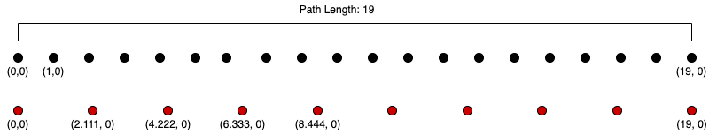

 Gesture Recognizer
================================

Implemented the $1 Gesture recognizer Algorithm from the [research paper](./res/1dollar.pdf)  which was published at the User Interface Software and Technology (UIST) Symposium in 2007 through the guidance and instructions from Professor Bret Jackson as part of Data Structures Class. 


** Breif steps **

The resample test should provide the following steps when resampling from 20 points along the x-axis to 10 points:



```
Resample interval: 2.111111111111111
Adding first point (0.0, 0.0)
Previous point: (0.0,0.0) Current point: (1.0,0.0) segmentDistance=1.0 accumulatedDistance=1.0
Previous point: (1.0,0.0) Current point: (2.0,0.0) segmentDistance=1.0 accumulatedDistance=2.0
Previous point: (2.0,0.0) Current point: (3.0,0.0) segmentDistance=1.0 accumulatedDistance=3.0
	Adding resampled point: (2.111111111111111,0.0)
Previous point: (2.111111111111111,0.0) Current point: (3.0,0.0) segmentDistance=0.8888888888888888 accumulatedDistance=0.8888888888888888
Previous point: (3.0,0.0) Current point: (4.0,0.0) segmentDistance=1.0 accumulatedDistance=1.8888888888888888
Previous point: (4.0,0.0) Current point: (5.0,0.0) segmentDistance=1.0 accumulatedDistance=2.888888888888889
	Adding resampled point: (4.222222222222222,0.0)
Previous point: (4.222222222222222,0.0) Current point: (5.0,0.0) segmentDistance=0.7777777777777777 accumulatedDistance=0.7777777777777777
Previous point: (5.0,0.0) Current point: (6.0,0.0) segmentDistance=1.0 accumulatedDistance=1.7777777777777777
Previous point: (6.0,0.0) Current point: (7.0,0.0) segmentDistance=1.0 accumulatedDistance=2.7777777777777777
	Adding resampled point: (6.333333333333334,0.0)
Previous point: (6.333333333333334,0.0) Current point: (7.0,0.0) segmentDistance=0.6666666666666661 accumulatedDistance=0.6666666666666661
Previous point: (7.0,0.0) Current point: (8.0,0.0) segmentDistance=1.0 accumulatedDistance=1.666666666666666
Previous point: (8.0,0.0) Current point: (9.0,0.0) segmentDistance=1.0 accumulatedDistance=2.666666666666666
	Adding resampled point: (8.444444444444445,0.0)
Previous point: (8.444444444444445,0.0) Current point: (9.0,0.0) segmentDistance=0.5555555555555554 accumulatedDistance=0.5555555555555554
Previous point: (9.0,0.0) Current point: (10.0,0.0) segmentDistance=1.0 accumulatedDistance=1.5555555555555554
Previous point: (10.0,0.0) Current point: (11.0,0.0) segmentDistance=1.0 accumulatedDistance=2.5555555555555554
	Adding resampled point: (10.555555555555555,0.0)
Previous point: (10.555555555555555,0.0) Current point: (11.0,0.0) segmentDistance=0.44444444444444464 accumulatedDistance=0.44444444444444464
Previous point: (11.0,0.0) Current point: (12.0,0.0) segmentDistance=1.0 accumulatedDistance=1.4444444444444446
Previous point: (12.0,0.0) Current point: (13.0,0.0) segmentDistance=1.0 accumulatedDistance=2.4444444444444446
	Adding resampled point: (12.666666666666666,0.0)
Previous point: (12.666666666666666,0.0) Current point: (13.0,0.0) segmentDistance=0.3333333333333339 accumulatedDistance=0.3333333333333339
Previous point: (13.0,0.0) Current point: (14.0,0.0) segmentDistance=1.0 accumulatedDistance=1.333333333333334
Previous point: (14.0,0.0) Current point: (15.0,0.0) segmentDistance=1.0 accumulatedDistance=2.333333333333334
	Adding resampled point: (14.777777777777777,0.0)
Previous point: (14.777777777777777,0.0) Current point: (15.0,0.0) segmentDistance=0.2222222222222232 accumulatedDistance=0.2222222222222232
Previous point: (15.0,0.0) Current point: (16.0,0.0) segmentDistance=1.0 accumulatedDistance=1.2222222222222232
Previous point: (16.0,0.0) Current point: (17.0,0.0) segmentDistance=1.0 accumulatedDistance=2.222222222222223
	Adding resampled point: (16.88888888888889,0.0)
Previous point: (16.88888888888889,0.0) Current point: (17.0,0.0) segmentDistance=0.11111111111111072 accumulatedDistance=0.11111111111111072
Previous point: (17.0,0.0) Current point: (18.0,0.0) segmentDistance=1.0 accumulatedDistance=1.1111111111111107
Previous point: (18.0,0.0) Current point: (19.0,0.0) segmentDistance=1.0 accumulatedDistance=2.1111111111111107
Adding last point: (19.0,0.0)
```

#### Rotate to Zero

1. Calculate the indicative angle by finding the centroid of the points, i.e the average of the x and y values of the points, and subtracting the first point in the gesture. The angle this makes with the x-axis is the indicative angle.
2. Rotate each point in the gesture around the centroid by the **negative** indicative angle to align the gesture with the x-axis.
3. You can confirm that rotation is correct by running the visualizer. Visually confirm that the red rotated arrow points along the x-axis.

#### Scale to Square

1. Calculate bounding size (width and height) of the gesture. The width is the maximum x value for any point in the gesture minus the minimum x value. The height is the maximum y value minus the minimum y value.
2. Scale each point in the gesture by (size / width, size / height), so that the resulting bounding box will be a square with width and height equal to size. We use size=250, but you should make this a named constant so its easy to change later.
3. Visually confirm in the Visualizer that the green scaled arrow is distorted into a square shape.

#### Translate to point

1. Calculate the centroid of the points.
2. Translate to a point k, by adding k to each point in the gesture and subtracting the centroid.
3. Visually confirm in the visualizer that the pink arrow's centroid is centered on the origin, k = (0,0).

#### Recognition

The path-distance between a gesture (G) and a template gesture (T) is the mean of the distances between the points at each index, i.e. the distance between G_0 and T_0, plus the distance from G_1 to T_1, etc divided by n. This is described in equation 1 in the paper.
The `distanceAtBestAngle` method performs the golden section search for the rotation angle that minimizes the distance between a gesture and a template. It returns the path-distance at this angle. If you are curious how this works, here is a good [video explanation](https://www.youtube.com/watch?v=VBFuqglVW3c).

To recognize a gesture, iterate over the possible templates. For each template, calculate the distanceAtBestAngle between the gesture and the candidate template. Keep track of the minimum distance found and the corresponding template. Return the matching template and score calculated using equation 2 in the paper.

### Appropriate Resources

In this assignment, the primary learning goals are to gain practice using data structures, develop good object-oriented organizational habits, and to learn how to convert pseudo-code into valid java. As a published research algorithm, there are many code solutions that exist for the $1 gesture recognizer. Looking at these or any other student's code would negate the benefits you will gain by completing the assignment and is a violation of Macalester's academic integrity policy. You may discuss the assignment with other students, but do not share your code or look at other code. **The only resources you may use to help you on the assignment are the research paper and pseudo-code described above.**  Misuse of resources will result in a zero grade and further action per Macalester's policy on Academic Integrity. If you get stuck, I would encourage you to visit the preceptor's or my office hours to get help.

